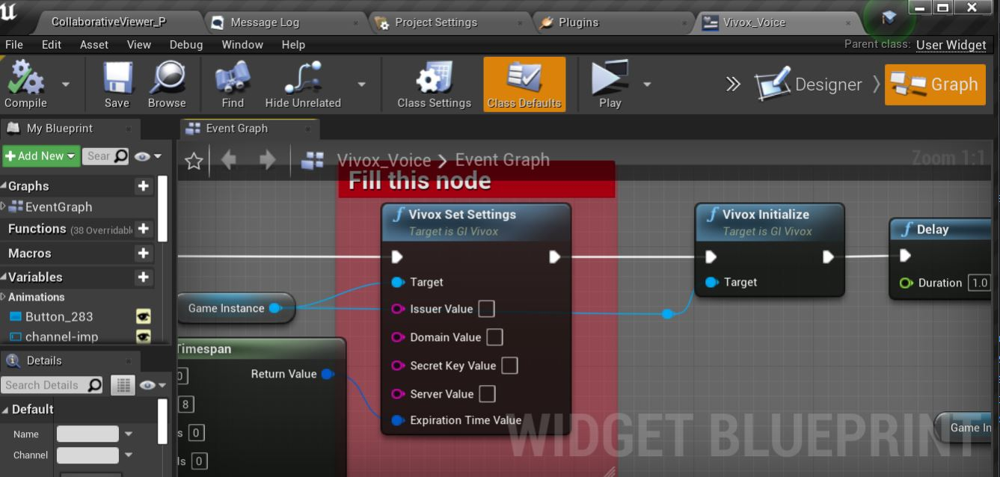
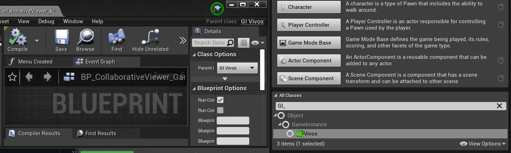

# Vivox Voice Chat For Unreal Engine 4.26.2 With Blueprint Support

Template Project that will help you use Vivox Voice Plugin in Blueprints. 

This Template Consists of 15 blueprint functions and events that will help you implement Vivox Faster and easier.
Template includes Voice Chat, Text Chat, Audio Devices and Participants Interfaces by Vivox .

It does not Supporting Presence and Positional Audio Yet.

## How To Use The Template:

- Login To Vivox Developer Portal and Install The Vivox Core Plugin For Unreal Engine
- Unzip the Plugins into Plugins Folder
- Open the .Sln File and Build the Project.
- Once build done, Open uproject file.
- Open Vivox_Voice Widget->Graph
- Set The Credentials you Recieved From Vivox To "Vivox Set Setting" Node
- run the Project

Note: All Codes were made in a game instance Class and not on Blueprint Function Library so dont forget to Set correct Blueprint Class.

